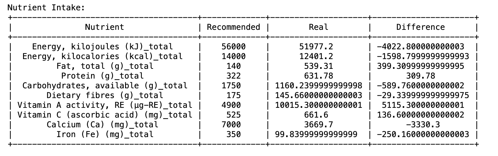

# Nutrition Analysis Project

## Overview

This project aims to analyze my weekly nutrition data and provide insights into nutrition by comparing it with recommended intake levels. It involves merging dietary data with nutritional information, calculating total nutrient content, and visualizing the results for easy interpretation.

## Motivation

I would like to make understand my diet better and make some necessary changes if possibles. As there are many nutrients in my datasource, I decided to only concentrate on 10 of them. 

1. Energy, kilojoules (kJ) and Energy, kilocalories (kcal):
    - Essential for providing the body with the energy required for daily activities and metabolic processes.
2. Protein (g):
    - Crucial for building and repairing tissues, supporting immune function, and serving as a source of energy when needed.
3. Fat, total (g):
    - Important for providing energy, absorbing fat-soluble vitamins, maintaining cell membrane integrity, and supporting hormone production.
4. Carbohydrates, available (g):
    - Primary source of energy for the body, particularly for the brain and muscles, and play a role in regulating blood sugar levels.
5. Dietary fibres (g):
    - Essential for maintaining digestive health, promoting regular bowel movements, and reducing the risk of chronic diseases such as heart disease and diabetes.
6. Vitamin A activity, RE (µg-RE):
    - Necessary for vision, immune function, skin health, and cell growth and differentiation.
7. Vitamin C (ascorbic acid) (mg):
    - Acts as an antioxidant, supporting immune function, collagen synthesis, wound healing, and enhancing iron absorption.
8. Calcium (Ca) (mg):
    - Essential for bone health, muscle function, nerve transmission, and blood clotting.
9. Iron (Fe) (mg):
    - Vital for transporting oxygen throughout the body, supporting energy metabolism, and maintaining healthy red blood cells.
10. Potassium (K) (mg):
    - Important for regulating fluid balance, muscle contractions (including the heart), nerve function, and blood pressure control.

      
## Features

- Merge dietary data with nutritional information
- Calculate total nutrient content for each food item
- Compare total nutrient content with recommended intake levels
- Visualize the results using graphical presentations.
  
## Results

